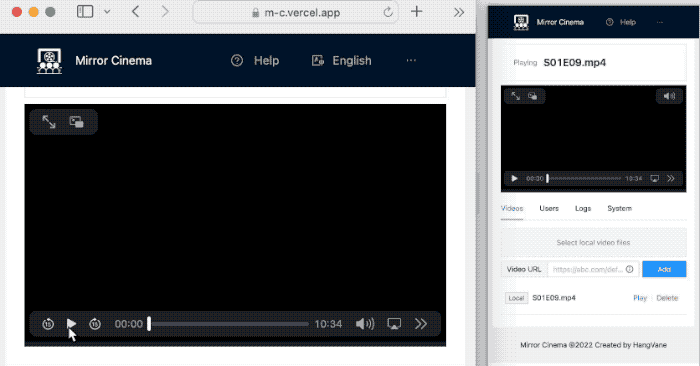

<div align="right">
  English | 
  <a href="#中文">简体中文</a>
</div>
<p align="center">
  <a href="https://m-c.vercel.app/">
    
  </a>
</p>

<h1 align="center">
  <a href="https://m-c.vercel.app/" target="_blank">Mirror Cinema</a>
</h1>

<div align="center">
  A website-based video player for sharing videos remotely and synchronously.
</div>

## Demo

<p align="center">
  
</p>

## Features

- Play videos with your friends from URLs or local files. The playback status (progress, play/pause, speed) is fully synchronized.
- No need to download/install/deploy. The website-based tool is available across platforms.
- Free service provided by LeanCloud. Register once, share anywhere.
- More features are in development...

## Usage

Open <a href="https://m-c.vercel.app/" target="_blank">Mirror Cinema</a>, send the sharing URL to your friends, select the video, and then watch together!


## Tutorial

1. Enter the website for the first time, you need to switch to the `System` TAB and fill in the necessary parameters `AppId`, `AppKey`, `Server` for LeanCloud. Please refer to #LeanCloud section for further information.

2. After input, you can click the `share` button to send it to your partner, without their needs to enter parameters again;
3. When connected, you can enter the local or network videos you want to watch together in the `Videos` TAB, and share the network videos with your partner (local videos cannot be directly shared and need to be manually added by your partner).
4. Play the same video with your partner, and now the video's progress, speed, pause/resume are all synchronizing!

**Note: Mirror Cinema is only responsible for synchronizing the progress of the video, and would not inform you if you and your partner choose different videos to play.**

### Apply for LeanCloud

1. Sign up at https://leancloud.app；

2. Login the LeanCloud Console, select `Create Application`, select `Development version` (i.e., free version) to create.
3. Enter the newly created application, go to `Settings` -> `Application credentials`, fill `AppID`, `AppKey` and `REST API server address` in the corresponding positions of the Mirror Cinema `System` TAB and then update.

### Sharing

#### Parameter Sharing

Click the `Share` button in the `System` TAB to generate the parameter sharing URL. Send it to your partner. Open the URL to join the same room automatically without configuring LeanCloud.

#### Video Sharing

After adding a network video, click the `Share` button to generate a video sharing URL. Send it to your partner to automatically play the same network video, and the LeanCloud parameters are also synchronized automatically.

### Video Format Compatibility

|         | MP4 (H.264) | MKV (H.265) | MKV (AV1) | WebM |
|:-------:|:-----------:|:-----------:|:---------:|:----:|
| Chrome  |      ✓      |             |     ✓     |  ✓   |
|  Edge   |      ✓      |      ~      |     ✓     |  ✓   |
| Safari  |      ✓      |      ✓      |           |  ✓   |
|   iOS   |      ✓      |      ✓      |           |  ~   |
| Firefox |      ✓      |             |     ✓     |  ✓   |
|  Opera  |      ✓      |             |     ✓     |  ✓   |


## Development tutorial

> Before starting, please ensure you have installed ``yarn``.

Clone the repository:
```bash
git clone https://github.com/hangvane/mirror-cinema.git
```

Enter the directory of `package.json`, and then execute:
```bash
yarn
```
Wait until the installation is complete.

Debug:
```bash
npm run dev
```

Build:
```bash
npm run build
```

preview:
```bash
npm run preview
```

Welcome to put forward suggestions or implementation ideas!

Pull Request is welcome!

## Thanks

> [Sync Player](https://github.com/liyang5945/sync-player/)

Thanks to Sync Player for the core idea: Synchronizing the video playback by free LeanCloud communication service.

# 中文

<p align="center">
  <a href="https://m-c.vercel.app/">
    
  </a>
</p>

<h1 align="center">
  <a href="https://m-c.vercel.app/" target="_blank">Mirror Cinema</a>
</h1>

<div align="center">

一个视频播放网站，可以远程一起看视频。

</div>

## 演示

<p align="center">
  
</p>

## 特性

- 播放来自网络URL的视频或本地视频，播放进度（进度条、播放/暂停、倍速）完全同步；
- 无需下载/安装/部署，跨平台可用；
- 基于Leancloud提供免费通信服务，一人注册，多人共享；
- 更多特性持续开发中……

## 用法

打开<a href="https://m-c.vercel.app/" target="_blank">Mirror Cinema</a>，将你的分享链接发给朋友，选择视频，一起观看！

## 使用指引

1. 第一次进入网站，需要切换至`系统信息`选项卡，填写LeanCloud通讯的必要参数`AppId`, `AppKey`, `Server`，获得该信息的做法请参考 # LeanCloud参数配置 小节；

2. 录入后，可使用`分享`功能发送给同伴，ta无需再录入一遍参数；
3. 连接成功后，可以在`视频列表`选项卡录入想要一起看的本地或网络视频，还可以将网络视频分享给同伴（本地视频不能直接分享，需要同伴手动添加）；
4. 和同伴播放同一段视频，现在视频的进度、倍速、暂停/恢复已经全部同步了！

**注意：Mirror Cinema只负责同步视频的播放进度，而不检查是否真的播放了同一段视频，如果你和同伴选择了不同视频播放，Mirror Cinema是不会纠正的。**

### LeanCloud申请

1. 前往 https://www.leancloud.cn 注册；

2. 登录进LeanCloud控制台后，选择`创建应用`，其他信息任填，**注意计价方案选`开发版`**（也即免费版）；
3. 点击进入刚刚创建的应用，前往`设置` -> `应用凭证`，将`AppID`, `AppKey`, `REST API 服务器地址` 分别填入Mirror Cinema`系统信息`选项卡的对应位置并更新。

### 分享

#### 配置分享

在`系统信息`选项卡右上角，点击`分享`按钮可以生成配置分享链接，发送给同伴打开链接即无需再配置LeanCloud，自动加入同一个房间。

#### 视频分享

添加一条网络视频后，点击`分享`按钮可以生成视频分享链接，发送给同伴即可自动播放同一段网络视频，且LeanCloud参数也一并自动同步。

### 视频格式兼容性

|         | MP4 (H.264) | MKV (H.265) | MKV (AV1) | WebM |
|:-------:|:-----------:|:-----------:|:---------:|:----:|
| Chrome  |      ✓      |             |     ✓     |  ✓   |
|  Edge   |      ✓      |      ~      |     ✓     |  ✓   |
| Safari  |      ✓      |      ✓      |           |  ✓   |
|   iOS   |      ✓      |      ✓      |           |  ~   |
| Firefox |      ✓      |             |     ✓     |  ✓   |
|  Opera  |      ✓      |             |     ✓     |  ✓   |


## 开发指引

> 本节开始前，请准备好开发所需的yarn环境。

拉取代码：
```bash
git clone https://github.com/hangvane/mirror-cinema.git
```

进入`package.json`所在目录，执行

```bash
yarn
```
等待安装完成。

开发调试：
```bash
npm run dev
```

构建：
```bash
npm run build
```

预览：
```bash
npm run preview
```

欢迎提出功能建议，或技术实现思路！

欢迎Pull Request！

## 待办事项

### 待开发功能

1. 调整日志顺序，保持最低日志滚动（仿IDEA日志设计）
2. 播放按钮同步
3. 选举协议、心跳检测、延迟补偿
4. video.js支持
5. 房间信息显示
6. 聊天
7. 支持Youtube、Bilibili

### 待改进事项

1. 节流防抖
2. 日志虚拟滚动
3. 日志为空时 表头宽度保持不变
4. IM抽象为通用接口
5. 注释英文化
6. 全局异常捕获
7. inline js css到html
8. Leancloud参数正确性判断
9. 热重载LeanCloud Realtime，取消参数更新时对于im页面刷新的要求
10. 视频网址文本框绑定Enter键
11. URL解析提取至utils
12. about页显示版本号
13. 系统信息页表单校验

## 致谢

> [Sync Player](https://github.com/liyang5945/sync-player/)

感谢Sync Player提供的实现思路———利用免费的LeanCloud通讯服务来同步视频进度消息。
